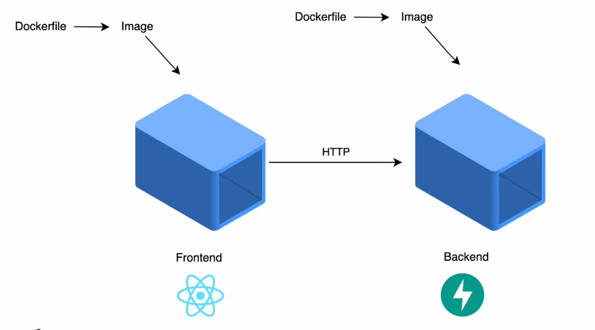
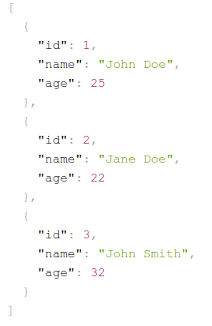
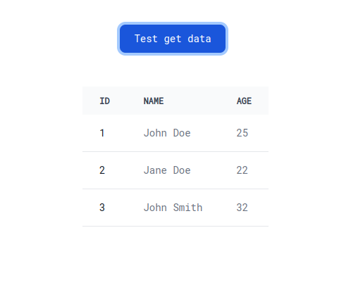

# Creación de un entorno Fullstack con Docker, FastAPI, React



Ejemplo de un entorno Full Stack con Docker, FastAPI y ReactJS en entorno de desarrollo.

Este ejemplo tiene la finalidad de mostrar como se puede comunicar un frontend con un backend FastAPI, con el frontend ReactJS, dockerizando 🐋 ambos entornos, y comunicando ambos entornos a través de una red de docker.

## Backend con FastAPI

Para backend se utiliza FastAPI, que solo para ejemplo se crea un endpoint `http://127.0.0.1/api` que devuelve un simple json.

Para poder ejecutar el backend, dentro de la carpeta `backend` se debe ejecutar el siguiente comando:

```bash
uvicorn app.main:app --reload --port 8000 --host 127.0.0.1
```



## Frontend con ReactJS

Para el frontend se utiliza ReactJS, con ViteJS, que solo para ejemplo se crea un componente que consume el endpoint del backend `http://127.0.0.1/api`; se utiliza la librería **Tanstack Query** para realizar la petición.

Para poder ejecutar el frontend, se modifica el archivo `vite.config.js`

```js
import react from "@vitejs/plugin-react";
import { defineConfig } from "vite";

// https://vitejs.dev/config/
export default defineConfig({
  plugins: [react()],
  server: {
    proxy: {
      "/api": {
        target: "http://localhost:8000",
        changeOrigin: true,
        secure: true,
      },
    },
  },
});
```

Se ejecutar el siguiente comando:

```bash
npm run dev
```

Para mostrar la siguiente pantalla:



## Dockerizar backend y frontend

En las carpetas `backend` y `frontend` se encuentran los archivos `Dockerfile` para poder dockerizar los entornos.

### Backend

Build the image

```bash
docker build -t docker-fastapi-backend -f Dockerfile .
```

Run the image

```bash
docker run -it --name container-fastapi-backend --rm -p 8000:8000 docker-fastapi-backend
```

**OR**

```bash
docker run -d --name container-fastapi-backend --rm -p 8000:8000 docker-fastapi-backend
```

### Frontend

Para poder ejecutar el frontend, se modifica el archivo `vite.config.js`

```js
import react from "@vitejs/plugin-react";
import { defineConfig } from "vite";

// https://vitejs.dev/config/
export default defineConfig({
  plugins: [react()],
  server: {
    host: "0.0.0.0",
    proxy: {
      "/api": "http://172.18.0.2:8000", // IP DEL LA RED DE DOCKER DEL BACKEND
    },
  },
});
```

Build the image

```bash
docker build -t docker-reactjs-frontend -f Dockerfile .
```

Run the image

```bash
docker run -it --name container-reactjs-frontend --rm -p 5173:5173 docker-reactjs-frontend
```

**OR**

```bash
docker run -d --name container-reactjs-frontend --rm -p 5173:5173 docker-reactjs-frontend
```

### Crear red de docker

Para poder comunicar ambos contenedores, se debe crear una red de docker.

```bash
docker network create net_back_front
```

### Conectar contenedores a la red

Para conectar los contenedores a la red, previamente detener los contenedores se debe ejecutar el siguiente comando:

Backend

```bash
docker run -it --name container-fastapi-backend --rm --network net_back_front -p 8000:8000 docker-fastapi-backend
```

Frontend

```bash
docker run -it --name container-reactjs-frontend --rm --network net_back_front -p 5173:5173 docker-reactjs-frontend
```

Verificar que los contenedores estén conectados mediante la red de docker mostrando la imagen de arriba.
